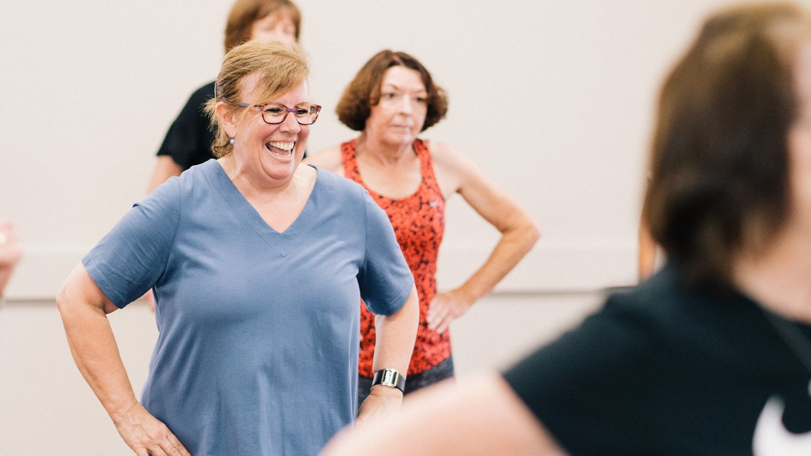
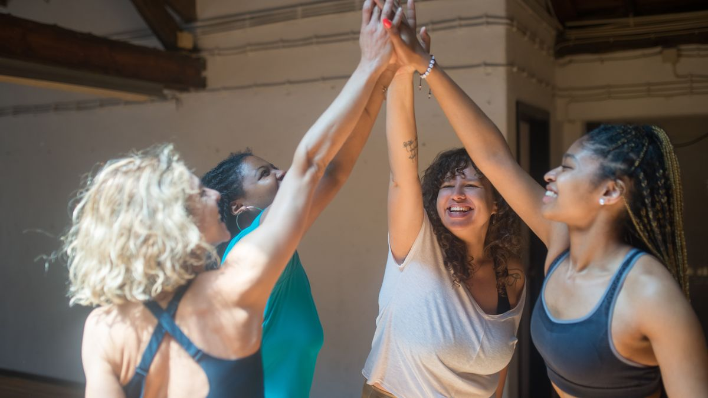
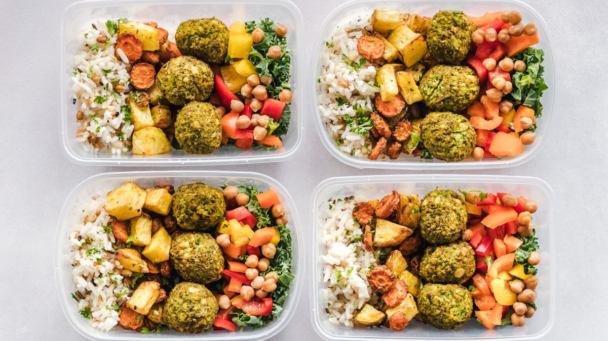
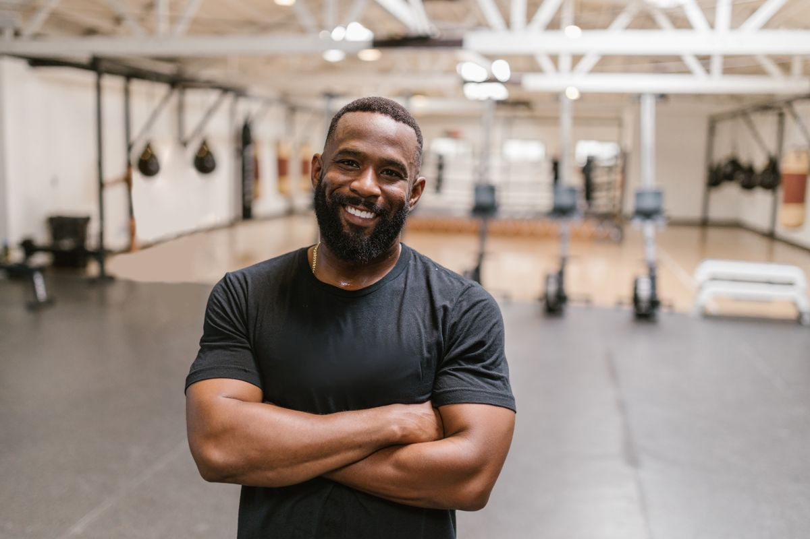

# Iron Tide — 6-Week Body Transformation Challenge
### Landing Page Copy

> Reading level: 5th–8th grade. Angle: blame-reversal + identity.
> Built on `research/customer-research.md`. Bracketed items need real input
> (testimonials, dates).

---

## 1. Hero



### Headline
# You didn't fail. The plan did.

### Subhead
You've tried before. You started strong, then life happened, and you ended up
right back where you started — blaming yourself. It was never you. It was a plan
built for someone else's life. In 6 weeks, with real coaching and a small group
that has your back, you'll feel like *yourself* again.

**[ Claim Your Spot — Book a Free Intro Call ]**

*Only 20 spots. Next group starts [DATE].*

---

## 2. The Problem

### If any of this sounds like you, you're in the right place.

You caught your reflection the other day and didn't recognize the person looking
back. You're tired all the time — tired when you wake up, tired by the afternoon,
tired in a way coffee doesn't fix. You get winded keeping up with your kids. Your
clothes don't fit the way they used to, and you've quietly stopped buying new ones
you actually like.

And the worst part? You've *tried.* The diets. The app. The membership you paid for
and stopped using. Each time you started with hope, and each time life got in the
way and you fell off. Now there's a little voice that says, *"Why bother? You'll
just quit again."*

Here's the truth: **you're not lazy, and you're not broken.** You're a busy adult
who was handed a plan that was never built for real life. No coach. No support. No
one checking in. Just you, alone, white-knuckling it until you burned out.

That's not a willpower problem. That's a setup problem. And it's fixable.

---

## 3. What Makes This Different



### "Okay… but why would this work when nothing else did?"

Fair question. You've earned the right to be skeptical. Here's exactly what's
different this time — and why it matters.

**1. You're not doing it alone.**
Every other time, you were on your own. Here, you have a real coach who knows your
name, a small group going through the exact same thing, and a private chat where
nobody quits in silence. When you have a rough week, we notice. That changes
everything.

**2. It's built for beginners — and scaled to YOU.**
No experience needed. Every single workout is scaled to your level. You will *not*
be the most out-of-shape person in a room full of 22-year-olds. This challenge is
*made* for people starting over. You'll be surrounded by adults just like you,
starting exactly where you are.

**3. It has a finish line.**
Not "the rest of your life." Just 6 weeks. A clear start, a clear end, and a clear
plan for each one. Six weeks is short enough to actually finish — and long enough
to see real change.

**4. We tell you exactly what to do.**
No guessing, no calorie math, no "figure it out yourself." You get a simple,
done-for-you meal guide and a coach who tells you what to do every session. You
just show up.

**5. We measure it — so you can't talk yourself out of your own progress.**
Before-and-after measurements and photos. Weekly check-ins. When that voice says
"this isn't working," the numbers will prove it wrong.

> You didn't lack willpower. You lacked a system and a team. Now you have both.

**[ I'm Ready — Claim My Spot ]**

---

## 4. What's Included

### Everything you need to actually finish — for $297.



For the full 6 weeks, you get:

- **3 small-group coached sessions a week** — real coaching, every workout scaled
  to your level. Show up and we handle the rest.
- **A simple done-for-you meal guide** — no calorie counting, no weird foods. Just
  clear, doable meals that fit a busy life.
- **Weekly check-ins & accountability** — someone in your corner every week, making
  sure you don't drift off track like before.
- **Before & after assessment** — measurements and photos so you can *see* your
  progress, not just guess at it.
- **Private member group chat** — a small crew of people just like you, cheering
  each other on so nobody quits alone.

**That's the full 6-week coached challenge for $297** — about what most people
waste on takeout and an unused gym membership in a single month, except this time
you'll have something to show for it.

**[ Claim Your Spot ]**

---

## 5. Social Proof

### Real people. Real starting-overs. Real results.

> *[INSERT TESTIMONIAL — ideally someone 30–50 who had tried and failed before.
> Include first name, age, and a specific result or feeling: "I have my energy
> back," "I fit into my old jeans," "first thing I've ever finished."]*
> **— [Name, Age]**

> *[INSERT TESTIMONIAL — focus on the "I was scared to walk in / I was the most
> out-of-shape" fear being overcome.]*
> **— [Name, Age]**

> *[INSERT TESTIMONIAL — focus on accountability / the group keeping them going.]*
> **— [Name, Age]**

> ```
> ┌─────────────────────────────────────────────┐
> │   BEFORE  &  AFTER  —  PLACEHOLDER          │
> │                                             │
> │   Insert 2–4 real member before/after       │
> │   photos here (with written consent).       │
> │   Label each with first name + result.      │
> └─────────────────────────────────────────────┘
> ```
> *Placeholder — do not launch with stock photos here. Use real members only.*

---

## 6. How It Works



### Getting started is simple. Three steps.

**Step 1 — Book your free intro call.**
We talk for a few minutes, learn about your goals, and answer your questions. No
pressure, no hard sell. We just make sure this is the right fit for you.

**Step 2 — Claim your spot and get your plan.**
Lock in one of the 20 spots, do your before assessment, and get your meal guide and
session schedule. You'll know exactly what's happening from day one.

**Step 3 — Show up and follow the plan.**
Come to your sessions, lean on your group, and let your coach guide you. We'll
handle the "what to do." You just keep showing up — and in 6 weeks, you'll see the
difference.

**[ Start With a Free Intro Call ]**

---

## 7. The Guarantee

### You take no risk. None.

We're so confident in this that here's our promise: **Show up to at least 80% of
your sessions and follow the plan — and if you don't see results, you get a full
refund.**

That's it. Do the work, and you either get the body changes you came for, or you
get your money back. The only way to lose is to not start.

You've wasted money before on things that left you alone to fail. This is the
opposite. The risk is on us.

**[ Claim Your Spot — Risk-Free ]**

---

## 8. FAQ

### "Why would this be different? I've tried and failed before."
Because every other time, you were alone — no coach, no group, no one checking in.
This challenge is built around support and accountability, with a clear 6-week
finish line. You didn't fail before; you were set up to fail. This is a different
setup, with people who won't let you quit in silence.

### "I'll be the most out-of-shape person there. Won't everyone judge me?"
No. This challenge is made *specifically* for beginners and people starting over.
Every workout is scaled to your level, and the group is full of everyday adults in
the exact same boat. There's no judgment here — only people who get it, because
they're living it too.

### "I don't have time for this."
It's 3 sessions a week for 6 weeks — that's it. Not forever, not every day. Most
people find that once it's on the calendar with a coach expecting them, it sticks
in a way "I'll go when I can" never did. Six weeks is short. You can do six weeks.

### "Is it really worth $297?"
Think about what you've already spent on diets, apps, and memberships you didn't
use — money gone with nothing to show for it. This is $297 for real coaching, a
real plan, real accountability, and a money-back guarantee. And if it doesn't work
when you do the work, you don't pay. The bigger cost is another year of feeling
stuck.

### "I'm too out of shape / too old to even start."
You don't need to "get in shape first." That's the trap that keeps people stuck
forever. We meet you exactly where you are today — out of shape, out of practice,
nervous, all of it. Day one is the right day. Your age and your starting point are
not problems here; they're exactly who this is for.

---

## 9. Urgency + Final CTA

### Only 20 spots. The next group starts [DATE].

We keep these groups small on purpose — so every person gets real coaching and
real attention. That means **only 20 spots per challenge**, and they fill up.

You've spent long enough feeling stuck, tired, and frustrated with yourself. You
already know that another month of "I'll start Monday" leads to another year of the
same. The only thing that changes that is starting — with a plan and a team that
won't let you fail.

Six weeks from now, you could feel like yourself again. Let's begin.

**[ Claim Your Spot — Book Your Free Intro Call ]**

*No pressure. No hard sell. Just a quick call to see if it's right for you.*

---

#### Lead Form

**Claim Your Spot — Book a Free Intro Call**

- First Name *
- Email *
- Phone (for your intro call) *
- What's your #1 goal for the next 6 weeks? *(optional)*

**[ Book My Free Call ]**

*Only 20 spots for the [DATE] group. Show up to 80% of sessions, follow the plan,
and if you don't see results — full refund.*
